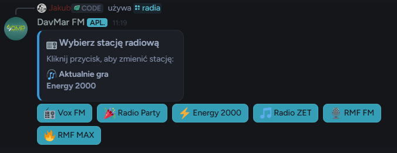
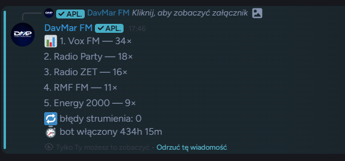
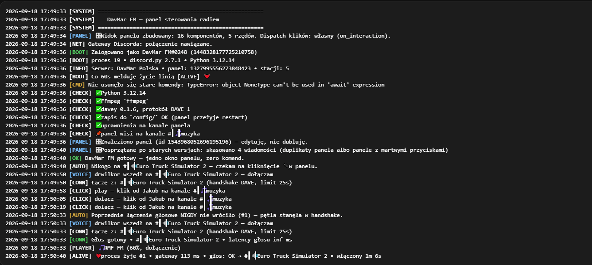

<div align="center">

# 📻 DavMar FM - Discord Radio Bot


[](#-licencja)

<br>

### 🎵 Bot radiowy Discord z obsługą wielu polskich stacji radiowych - Vox FM, Radio Party, Energy 2000, Radio ZET, RMF FM, RMF MAX

<br>

[✨ Funkcje](#-funkcje) •
[📸 Screenshots](#-screenshots) •
[🛠️ Technologie](#️-technologie) •
[📞 Kontakt](#-kontakt)

<br>

---

</div>

<br>

## ✨ Funkcje

<table>
<tr>
<td>

### 📻 Stacje Radiowe
- ✅ **Vox FM** - Muzyka pop
- ✅ **Radio Party** - Imprezy i zabawa
- ✅ **Energy 2000** - Dance i elektronika
- ✅ **Radio ZET** - Hity i nowości
- ✅ **RMF FM** - Największe hity
- ✅ **RMF MAX** - Dance i R&B

</td>
<td>

### 🎛️ Sterowanie
- ✅ **Ręczne sterowanie** - Bot dołącza po komendzie /join
- ✅ **Interaktywne menu** - Przyciski do wyboru stacji
- ✅ **Szybka zmiana** - Zmień stację w czasie rzeczywistym
- ✅ **Regulacja głośności** - Ustaw głośność 1-100%
- ✅ **Status ze stacją** - Wyświetla aktualną stację jako status

</td>
</tr>
<tr>
<td>

### 📊 Statystyki i Analityka
- ✅ **Licznik odtworzeń** - Automatyczne zliczanie statystyk
- ✅ **Historia odtwarzania** - Ostatnio grane stacje
- ✅ **Ranking stacji** - Top najczęściej słuchanych
- ✅ **Monitorowanie** - Starty, restarty, błędy
- ✅ **Watchdog system** - Automatyczny restart streamu

</td>
<td>

### 🎨 Design i UX
- ✅ **Kolorowe logi** - Czytelne logi z timestampami
- ✅ **Slash commands** - Nowoczesne komendy Discord
- ✅ **Interaktywne embedy** - Piękne panele informacyjne
- ✅ **Status bota** - Dynamiczny status ze stacją
- ✅ **Błędy i logi** - Szczegółowe logowanie systemowe

</td>
</tr>
</table>

<br>

## 📸 Screenshots

### 🎵 Bot Discord w Akcji



*Interaktywne menu radiowe z przyciskami*

<br><br>

### 📊 Statystyki i Ranking



*Raporty odtwarzania i ranking stacji*

<br><br>

### 🎨 Kolorowe Logi Systemowe



*Kolorowe logi z timestampami i kategoriami*

<br>

---

## 🎨 Przykładowe Logi

```
2026-03-09 10:15:43 [SYSTEM] ⚙️ ==================================================
2026-03-09 10:15:43 [OK] Zalogowano jako DavMar FM#7471
2026-03-09 10:15:43 [INFO] discord.py 2.7.1
2026-03-09 10:15:43 [SYSTEM] ⚙️ ==================================================
2026-03-09 10:15:43 [INFO] Serwer: DavMar Discord
2026-03-09 10:15:43 [MUSIC] 🎵 Gra stacja: RMF FM
2026-03-09 10:15:43 [OK] DavMar FM Bot gotowy do pracy!

2026-03-09 10:16:04 [VOICE] 🔊 Łączę z: 📻 Radio
2026-03-09 10:16:06 [PLAYER] Odtwarzanie RMF FM rozpoczęte
2026-03-09 10:16:10 [MUSIC] 🎵 Zmieniono stację na: Radio ZET
2026-03-09 10:16:15 [STATS] 📊 Odtwarzanie #45: RMF FM
```

<br>

## 🛠️ Technologie

<div align="center">

[](https://python.org/)
[](https://discordpy.readthedocs.io/)
[](https://ffmpeg.org/)
[](https://aiohttp.readthedocs.io/)

</div>

### Stack Techniczny:

- **Runtime:** Python 3.12+ z discord.py[voice] 2.7.1
- **Audio:** FFmpeg do obsługi streamów radiowych
- **HTTP:** aiohttp do zapytań o stacje radiowe
- **Environment:** python-dotenv do zarządzania konfiguracją
- **Security:** pynacl do szyfrowania voice connections

<br>

## 📁 Struktura Projektu

```
davmar-fm-bot/
├── 📄 bot.py              # Główny plik bota (762 linii)
├── 📄 .env                # Konfiguracja (DISCORD_TOKEN, GUILD_ID)
├── 📄 .env.example        # Przykładowa konfiguracja
├── 📄 requirements.txt    # Zależności Python
├── 📄 README.md           # Ta dokumentacja
├── 📄 LICENSE             # Licencja MIT
├── 📁 .venv/              # Wirtualne środowisko Python
└── 📁 screenshots/        # Zrzuty ekranu bota
```

<br>

## 💼 Dostępne na zamówienie

<div align="center">

### 🎯 Chcesz takiego bota radiowego dla swojego serwera?

<br>

| Pakiet | Opis |
|--------|------|
| 🎵 **Basic** | Bot radiowy z 3 stacjami |
| 📻 **Professional** | Pełny bot z 6+ stacjami + statystyki |
| 🎚️ **Custom** | Dowolne stacje + custom funkcje |
| 🏢 **Enterprise** | Wsparcie 24/7 + hosting + utrzymanie |

<br>

---

## 📞 Kontakt

<div align="center">

### Zainteresowany? Napisz do mnie!

<br>

| Developer | Discord | GitHub |
|-----------|---------|--------|
| **DrWilkor** | [DrWilkor#446740090757316608](https://discord.com/users/446740090757316608) | [@WilkorPLYT](https://github.com/WilkorPLYT) |

</div>

<br>

## 📄 Licencja

<div align="center">

� **Closed Source - Wszelkie prawa zastrzeżone**

Ten projekt jest własnością autora. Kod źródłowy nie jest publicznie dostępny.

Nieautoryzowane kopiowanie, modyfikowanie lub dystrybucja jest zabroniona.

Autor: DrWilkor (WilkorPLYT)
Copyright © 2026 DrWilkor

</div>

<br>

---

<br>

## 👨‍💻 Autor

<div align="center">

[](https://github.com/WilkorPLYT)

<br>

Stworzony z ❤️ przez **DrWilkor** dla **DavMar**

<br>

| Developer | Discord | GitHub |
|-----------|---------|--------|
| DrWilkor | [](https://discord.com/users/446740090757316608) | [](https://github.com/WilkorPLYT) |

<br>

---

<br>

**⭐ Jeśli podoba Ci się ten projekt, zostaw gwiazdkę! ⭐**

</div>

<br>

---

<div align="center">

Made with ❤️ | DavMar FM © 2026

</div>
